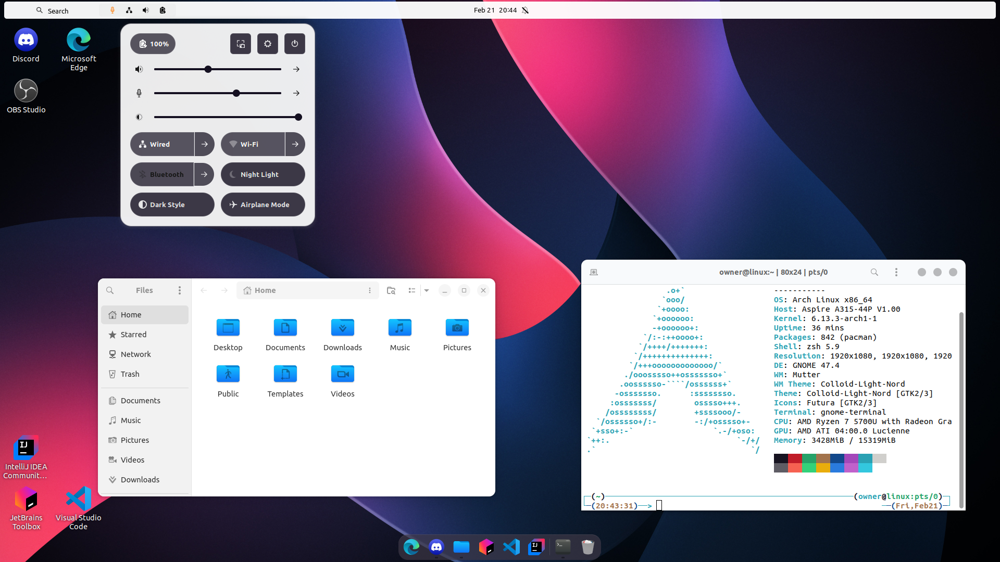
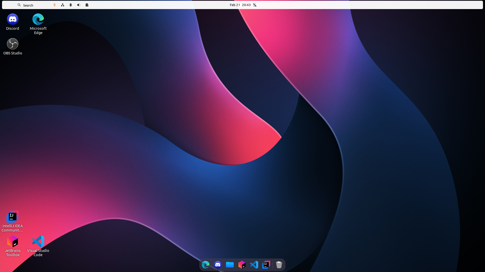
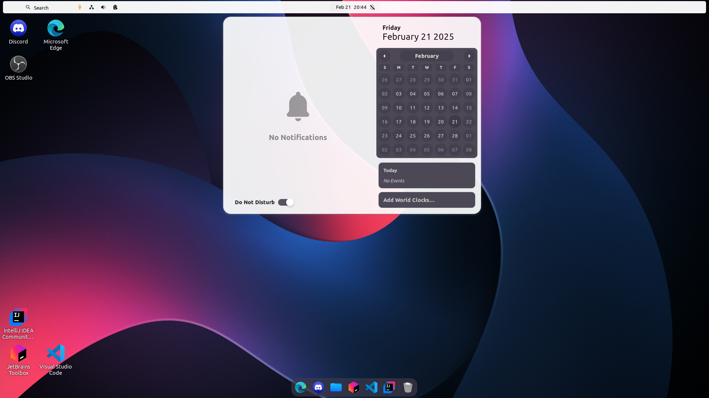
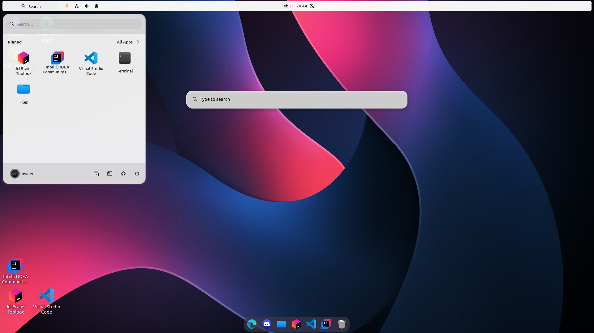

### 🧩 Extensions
These extensions are going to be installed:
- [Desktop Icons NG](https://extensions.gnome.org/extension/2087/desktop-icons-ng-ding/)
- [Arc Menu](https://extensions.gnome.org/extension/3628/arcmenu/)
- [Dash to Dock](https://extensions.gnome.org/extension/307/dash-to-dock/)
- [Search Light](https://extensions.gnome.org/extension/5489/search-light/)
- [OpenBar](https://github.com/neuromorph/openbar/)
- [Top bar organizer](https://gitlab.gnome.org/june/top-bar-organizer)

---

### 🎨 Theme, Icons & Fonts
- 🖌️ Theme: [Colloid Light Nord](https://github.com/vinceliuice/Colloid-gtk-theme)
- 🎭 Icons: [Futura](https://github.com/coderhisham/Futura-Icon-Pack)
- 🔤 Font: Ubuntu Regular (11), Sans (11), Ubuntu Mono (13)

---

### 🎭 Preview





---

### ⚡ Installation
Get this setup just by running the following command:
```shell
bash <(curl -s https://raw.githubusercontent.com/c4dots/gnome_white_mar_25/refs/heads/main/installer.sh)
```

##### Parameters:
- `--no-zsh`: Disables the installation or update of ZShell.
- `--no-themes`: Skips the installation of custom themes.
- `--no-icons`: Skips the installation of custom icon packs.
- `--no-packages`: Prevents the installation of additional software packages.
- `--no-background`: Prevents changing the background/wallpaper.
- `--no-search-light`: Disables the installation of the Search Light Extension.
- `--no-top-bar`: Disables the installation of the top bar.
- `--no-dash`: Prevents from installing the dash (/taskbar).
- `--no-ding`: Disables the installation of the Desktop Icons NG (DING) Extension.

_NOTE: You can also find this overview by using the `--help` flag when running the installer_